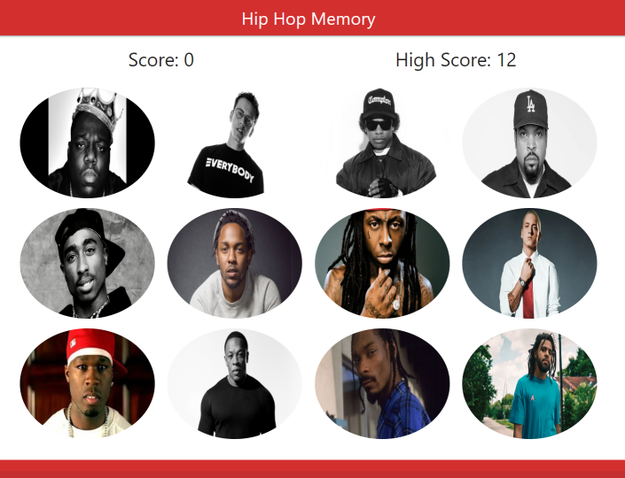

# Hip Hop Memory

The purpose of this React.js app is to test your memory in a *fun* way.

Check it out here: https://melher39.github.io/hip-hop-memory/

## Rundown

* When you visit the link above, you will be presented with this fun game.

* The instructions are very simple: 

    * Select an image to get a point, just don't click on any one image twice!

    * If you do, you will lose all your points and the game will restart.

    * The high score will be saved throughout your browsing session, unless you refresh the page.

    * The maximum number of points any user can get is 12, since there are only 12 images to select.

    * You will notice that the images are randomly displayed after every click (and refresh). This is what makes the game challenging!

    * Have fun!

## Behind The Scenes

* This app was built using the React.js library.

### Technologies/Tools Used In This App:
* Javascript
* HTML5, CSS3
* React.js
* Materialize.CSS
* GitHub Pages

### Challenges Faced:
* Since this is my first React.js app built from scratch, it took me a while to get familiar with the concepts of Components and State.
* Deploying to GitHub pages literally took me 2 hours. It was an error that had to do with the credentials, even though I was able to push/pull from the branch without an issue. How I solved it: create a new repo and copy (most of) the files into this new repo.

### Future Development: 
* Definitely would like to polish up the design and customize it better.
* Have different levels of difficulty by adding more images per session.

Thanks for your time! Hope you enjoyed this project.